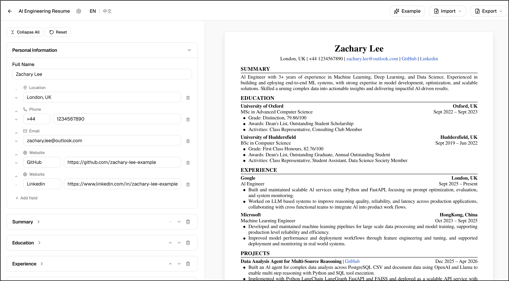

  
    
  
Professional resumes, effortlessly. No account needed.

  

    
    &nbsp;
    
    &nbsp;
    
    &nbsp;
    
  

---

CVForge is a free, open-source document builder for job seekers and academics. Everything runs in the browser — no sign-up, no server, no data stored anywhere. Build your document and export when you are ready.

> **Status** &nbsp; Approaching v1.0. Core editors are stable. Feedback and contributions are welcome.

## Features

**Resume Editor**

A general-purpose resume builder with a live A4 preview. Add, reorder, and rename sections to fit any role. Supports English and Chinese content.

**Academic CV Editor**

A full-featured academic CV editor covering research experience, publications, conference presentations, grants, teaching, professional service, and references.

**Cover Letter Editor**

A structured cover letter editor with sender and recipient blocks, body paragraphs, and the same live A4 preview found in the other editors.

**Export and Import**

Export any document as PDF, PNG, or JSON. JSON exports are fully portable — import them back into CVForge at any time to resume editing.

**No Account Required**

CVForge is entirely stateless. Your work lives in your browser's local storage and never touches a server.

## Tech Stack

| Layer | Technology |
|---|---|
| Framework | Next.js 16 (App Router, Turbopack) |
| Language | TypeScript (strict mode) |
| Styling | Tailwind CSS v4 |
| Components | shadcn/ui |
| Deployment | GitHub Pages (static export) |

## Contributing

Contributions are welcome. Please open an issue first to discuss what you would like to change. When submitting a pull request, make sure it targets the `dev` branch and references the related issue. Branch naming follows the pattern `feature/issue-{N}-short-description`.

To run the project locally, clone the repository, run `npm install`, then `npm run dev`.

## License

Distributed under the MIT License. See [LICENSE](LICENSE) for details.
