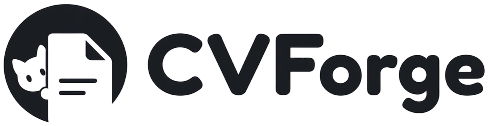
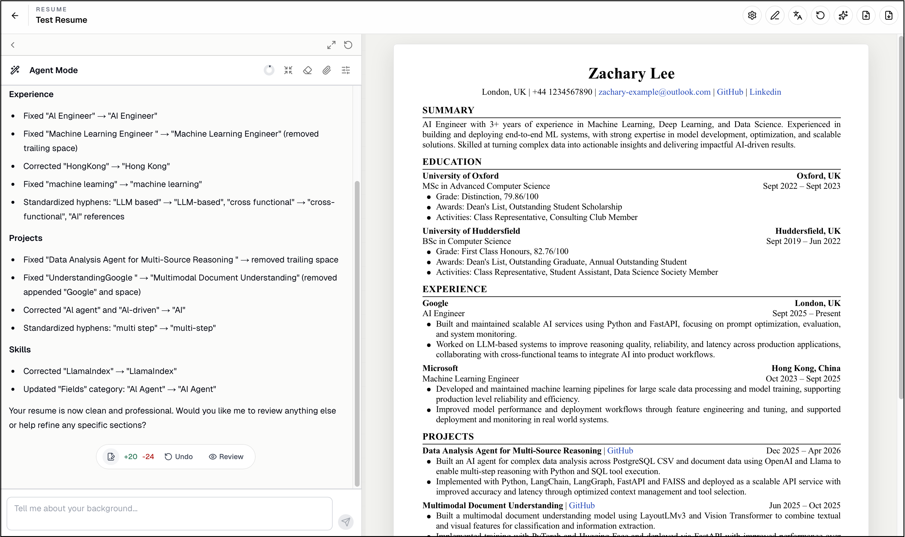

  
    
  
Professional documents, assisted by AI. No account needed.

  

    
    &nbsp;
    
    &nbsp;
    
    &nbsp;
    
  

---

CVForge is a free, open-source document builder for job seekers and academics. It combines structured editing, live preview, export tools, and Agent Mode in one focused workspace. No account is required.

> **Status** &nbsp; Approaching v1.0. Core editors are stable. Feedback and contributions are welcome.

## Features

CVForge helps you create polished application documents with structured editing, AI assistance, live preview, and export tools.

**Document types**

Create resumes, academic CVs, and cover letters. Resumes and academic CVs support English and Chinese document modes. Cover letters currently support English document mode only.

**Editing workflow**

Fill in structured fields manually, or use Agent Mode to add content, polish wording, review changes, and improve a document through chat. Agent Mode can also use uploaded files or a public LinkedIn profile as background context.

**Export and import**

Preview your document in A4 format, then export it as PDF, PNG, or JSON. JSON files can be imported back into CVForge for later editing.

## Tech Stack

| Layer | Technology |
|---|---|
| Framework | Next.js 16.2 with App Router and Turbopack |
| Runtime | React 19.2 client components |
| Language | TypeScript |
| Styling | Tailwind CSS v4 |
| UI | shadcn style local components, Base UI, lucide-react |
| Animation | GSAP and local React Bits style components |
| Agent | OpenAI SDK, LangChain tools, Zod schemas |
| Markdown | react-markdown with remark-gfm |
| Export | html-to-image and jsPDF |
| Deployment | Static export for GitHub Pages |

The entire codebase was implemented using [Claude Code](https://claude.ai/code) and [OpenAI Codex](https://openai.com/index/openai-codex/).

## Contributing

Contributions are welcome. Please open an issue first to discuss what you would like to change. When submitting a pull request, make sure it targets the `dev` branch and references the related issue. Branch naming follows the pattern `feature/issue-{N}-short-description`.

To run the project locally, clone the repository, run `npm install`, then `npm run dev`.

## License

Distributed under the MIT License. See [LICENSE](LICENSE) for details.
